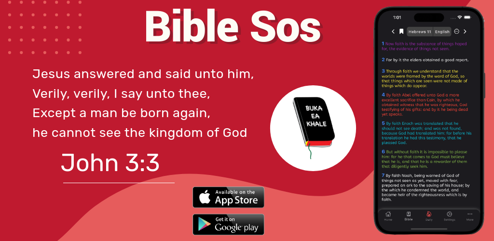

# 👨‍💻 Mothusi Molorane

**`Software Developer Java, Spring, Flutter`**

My name is Mothusi a full-stack developer and content creator on programming. I create content on Java technology. My video contents are not created the same way. I sometimes just create videos without any prior planning. You can see my videos starting with slide presentations followed by practical demos. I sometimes host other developers to have practical coding sessions. I publish all these on my YouTube channel "[JavaSpace]" 

## 🤩 Support YouTube. I am constantly uploading content

## 👨‍💻 Technologies

## 👨‍💻 My Projects

| Name | Description | Image |
| ---- | ----------- | ----- |
| Bible Sos | Is a bible with the following languages: Zulu, Xhosa, Afrikaans, Sepedi, Sesotho, English Features: |  |

<!--
**molorane/molorane** is a ✨ _special_ ✨ repository because its `README.md` (this file) appears on your GitHub profile.

Here are some ideas to get you started:

- 🔭 I’m currently working on ...
- 🌱 I’m currently learning ...
- 👯 I’m looking to collaborate on ...
- 🤔 I’m looking for help with ...
- 💬 Ask me about ...
- 📫 How to reach me: ...
- 😄 Pronouns: ...
- ⚡ Fun fact: ...
-->
